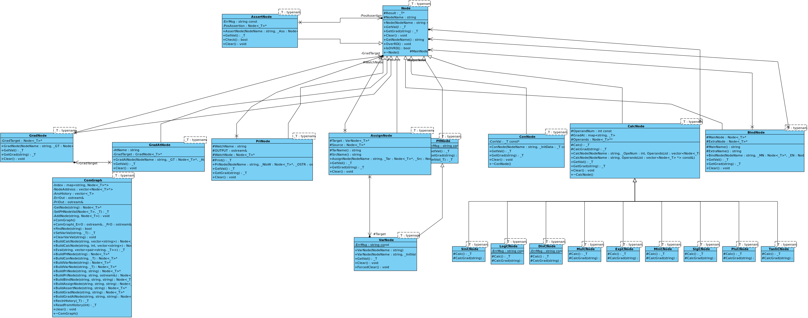

# 新增功能说明

## 新增成员

`Node<_T>::NodeName` ，用于记录节点名字

`map<string,_T> CalcNode<_T>::GradAt` 储存计算节点的偏导，简化计算，计算完成后会清空

其它类结构在下图UML图中展示

## 自动求导

接口：虚函数 `Node<_T>::GetGrad(string)`

全微分节点的建立：`GRAD OP`

其中 OP 为待求导节点

求偏导节点的建立：`OP1 AT OP2`

其中`OP1`指待求导节点，`OP2`指自变量

## Bind功能
新增`BindNode`类，该节点接受两个变量参数，该运算使得一个变量求值时能顺便求另一个变量的值

节点建立：`BIND OP1 OP2`

`OP1`，`OP2`为输入的变量参数

## Assert功能

新增`AssertNode`类，该节点接受一个变量参数，输出始终为0，并在变量小于等于0时报错

节点建立： `ASSERT OP`

`OP`为输入的变量参数

## Assign功能

新增`AssignNode`类，该节点接受两个变量参数，输出为第二个变量，运行该运算的后果是Variable的值变为第二个变量的值，同时Assign的赋值会在本次所有运算完成后进行二次访问——Clear()时进行

节点建立：`ASSIGN OP1 OP2`

`OP1`，`OP2`为输入的变量参数

# 新增算法实例

## 牛顿迭代法

利用迭代式 $x_{n+1} = x_n - \frac{f(x_n)}{f'(x_n)}$ 进行迭代，求得5个迭代值

具体实现在代码中有注释

## 梯度下降法（高维空间多自变量）

对于 $N+1$ 维空间中的 $M$ 个点

$$(x_{1,1},x_{1,2}, \dots ,x_{1,N},y_1)$$

$$(x_{2,1},x_{2,2}, \dots ,x_{2,N},y_2)$$

$$\dots$$

$$(x_{M,1},x_{M,2}, \dots ,x_{M,N},y_M)$$

想要确定线性关系 $f(x_1,x_2,\dots,x_N)=K_0+\sum_{i=1}^{N}{K_ix_i}$

使得 $L(K_0,K_1,\dots,K_N)=\sum_{i=1}^M{(f(x_{i,1},x_{i,2},\dots,x_{i,N})-y_i)^2}$ 最小

随机确定一组初始 $\{K_N\}$ 再利用 $K'_i=K_i-\delta $