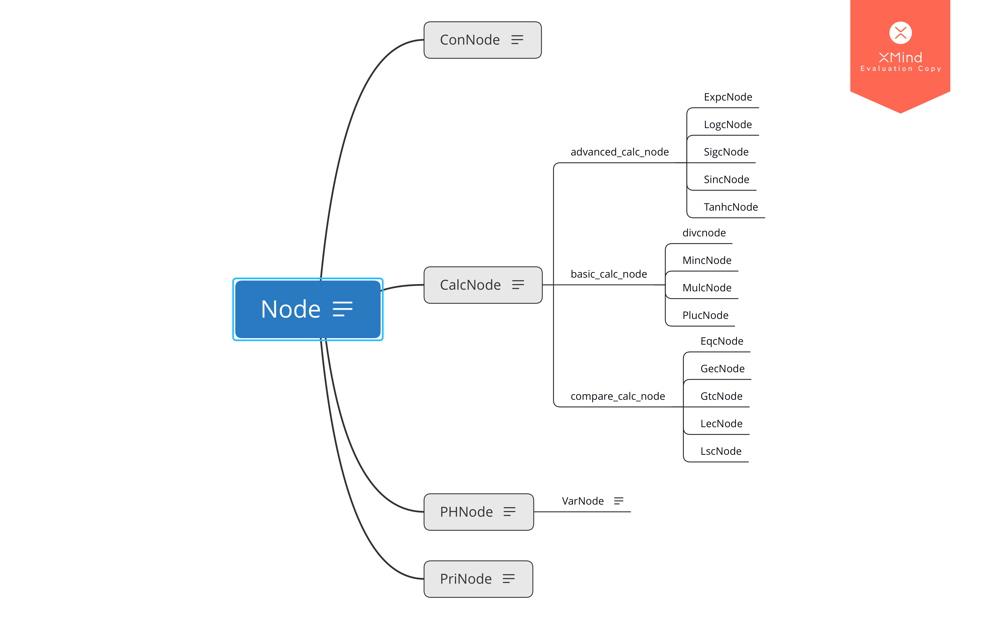

#开发注记

这篇注记比较长，推荐导出成 pdf 结合自动生成的目录查阅哦！

## 设计思路

### `class Node` 及其派生类

对于计算图的每一种节点，都有一个纯虚基类 `Node<_T>` 的派生类对应

类的继承关系如图，所有的继承都为 `public` 继承



每个节点都是一个对象，都有一个 `_T` 型指针 `_T *Result` 来记录在本次计算中的临时结果，并在计算结束后按需清除

每个节点都有虚函数 `_T GetVal()` 用于获取计算结果和保证不重复计算，都有虚函数 `void Clear()` 用来清除临时结果并递归清理其依赖节点的临时结果

### `CalcNode` 的处理

纯虚类 `CalcNode` 拥有最多的直接派生类，设计上集中了所有计算节点的公用功能——构造、求值、清除等

将计算函数作为纯虚函数留待派生类进行自定义，具体扩展方法可以参见后文

### `ComGraph`

`ComGraph` 是计算图的主体，也是主程序唯一应当建立的对象类型，所有的操作都应当通过 `ComGraph` 的接口完成

`ComGraph` 使用 `map<string, Node<_T>*>` 进行名字到节点地址的索引，由于索引中的节点可能被后建立的同名节点覆盖，因此额外建立一个 `vector<Node<_T>*>` 来记录已经建立的所有节点的地址方便遍历和清除

出于安全性考虑，节点仅会在被 `new` 时通过建立该节点的接口函数返回值返回一次该节点的地址以供调试，之后无法再通过任何借口获取其地址

本类提供的接口主要有：

- 各种节点的建立（其中所有 `CalcNode` 的建立共用一个带模板的函数使功能更加聚合）
- 查找某个名称的节点是否已存在
- 设置/清除变量的值
- 给定一些占位符的值并计算某个节点的值

本类还提供了一个 `vector<_T>` 来记录每次操作的历史答案，并提供了一对配套的接口——存储与读取

对于一些常见错误，也提供了一定的预警和纠错机制

## 库与类功能介绍

### Node

`Node` 是一个虚基类

#### 保护成员列表：

##### `_T *Result;`

用于储存计算结果，为空表示未计算出答案

#### 公开成员列表：

##### `virtual _T GetVal() = 0;`

纯虚函数，获取答案时使用，需要在派生类中被重载

##### `virtual void Clear() = 0;`

纯虚函数，清除答案，需要在派生类中被重载

<br/>

### ConNode : Node

`ConNode` 继承自 `Node` ，是常数节点

#### 私有成员列表

##### `_T *const ConVal;`

用来储存常数值

初始化时就必须将 `ConVal` 指针指向 `_T` 类常数，不提供修改接口

#### 公开成员列表

##### `_T GetVal();`

重载基类的 `GetVal()` ，直接返回 `*ConVal`

##### `void Clear();`

重载基类的 `Clear()` ，什么都不干

<br/>

### PHNode : Node

`PHNode` 继承自 `Node` ，是占位符节点

#### 私有成员列表

##### `const std::string ErrMsg;`

一个字符串，会在需要 `GetVal()` 但本节点并未被赋值时被作为异常抛出

#### 公开成员列表

##### `_T GetVal();`

重载基类的 `GetVal()` ，返回被 `SetVal(_T)` 赋的值

若未被 `SetVal(_T)` 赋值过，则抛出 `ErrMsg`

##### `_T SetVal(_T);`

在Eval的时候会被调用，给该节点赋值，结果储存在 `*Result`

<br/>

### VarNode : PHNode

`VarNode` 继承自 `PHNode` ，是变量节点

#### 私有成员列表

##### `const std::string ErrMsg;`

一个字符串，会在需要 `GetVal()` 但本节点并未被赋值时被作为异常抛出

#### 公开成员列表

##### `_T GetVal();`

重载基类的 `GetVal()` ，返回被 `SetVal(_T)` 赋的值

若未被 `SetVal(_T)` 赋值过，则抛出 `ErrMsg`

##### `_T SetVal(_T);`

在Eval的时候会被调用，给该节点赋值，结果储存在 `*Result`

<br/>

### CalcNode : Node

`CalcNode` 继承自 `Node` ，是进行计算操作的节点，是虚基类

#### 保护成员列表

##### `const int OperandNum;`

记录计算节点操作元的个数

##### `Node<_T> **Operands;`

指向所有操作元的指针数组

##### `virtual _T Calc() = 0;`

虚函数，进行计算，结果储存在 `Result` 中

不可从外部调用，仅在 `Result` 为空指针时由 `GetVal()` 调用

#### 公开成员列表

##### `_T GetVal();`

重载基类的求值函数，在 `Result` 为空指针时调用 `Calc()` 求值，否则直接返回答案

##### `void Clear();`

重载基类的清除函数，会在清除自身答案前递归调用所有操作元的清除函数

#### 构造函数

##### `CalcNode(int, const vector<Node<_T> *> &)`

推荐的构造方法，给出操作元个数，给出操作元指针列表来初始化一个CalcNode（的派生类），可以有效避免vector后面一不小心加入了多余的东西

##### `CalcNode(const vector<Node<_T> *> &)`

仅给出操作元指针列表来初始化一个CalcNode（的派生类），请确保指针列表仅仅只含有操作元的指针

<br/>

### PriNode : Node

`PriNode` 继承自 `Node` ，是输出节点

#### 保护成员列表

##### `std::string WatchName`

需要被输出的节点名称

##### `Node<_T> *WatchNode`

需要被输出的节点地址

##### `_T Print()`

在首次对该节点求值时调用，求出被观察节点的答案，输出，并将之作为本节点的答案

#### 公开成员列表

##### `_T GetVal()`

重载基类的求值函数，返回结点的值，初次访问时会调用 `Print()`

##### `void Clear()`

重载基类的清除函数，清除被观察节点和当前节点的临时答案

<br/>

### `ComGraph`

#### 私有成员列表

##### `map<string, Node<_T> *> Index`

从节点名称到地址的索引，用于在类外调用时根据类外传入的 `string` 型节点名称快速找到对应节点地址

##### `vector<Node<_T> *> NodeAddress;`

记录所有建立过的节点地址，用于在析构或清除时找到所有由该类申请过的空间

##### `vector<_T> AnsHistory`

储存命令的结果，有配套的接口对其进行处理，后续开发如果用不到可以删去

##### `ostream &ErrOut, &PriOut`

错误信息和默认 `PriNode` 输出流，在构造时需要自定义

##### `Node<_T> *GetNode(string)`

获取指定名称对应的节点地址，若没找到则会输出错误信息并抛出异常

##### `_T SetPHNodeVal(Node<_T> *, _T)`

为占位节点赋值，仅在 `Eval` 时被调用，不可从外部调用

#### 公开成员列表

##### `bool FindNode(string)`

检查图中是否有节点以指定名称命名

##### `_T SetVarVal(string, _T)`

为变量节点赋值，参数为变量节点的名称和需要赋的 `_T` 型值

##### `void ClearVarVal(string)`
 
清除（暂时禁用）指定名称的变量节点，测试程序中用不到，但提供了此接口

##### `_T Eval(string, vector<pair<string, _T>>)`

计算给定名称节点答案， `vector` 内用 `pair` 存储参数， `pair` 的首元素为占位节点名称，次元素为需要赋的值

调用时会先对占位符进行赋值，之后对目标节点进行求值，最后清除临时答案，清除赋值，返回结果

如果计算过程中出现取值错误，会立即终止计算，输出错误信息，但也会清除临时答案

##### `_T RecInHistory(_T)`

记录某一次操作的答案

##### `_T ReadFromHistory(int)`

读取某一次操作的答案

##### `void clear()`

清除计算图中所有的数据，析构时也会调用

#### 计算节点的构造

计算节点使用模板函数，在调用时需要给定计算节点的具体派生类，如：

```
GRAPHNAME.BuildCalcNode<CALCNODECLASS<TYPENAME>>(...);
```

可以在计算图 `GRAPHNAME` 中建立 `CALCNODECLASS<TYPENAME>` 类型的计算节点 

建立完成后会返回建立的节点的地址，

参数表有两种形式

##### `(string, std::vector<string>)`

给出待建立节点名称，给出依赖节点的名称列表

##### `(string, int, std::vector<string>)`  

推荐，额外给出了依赖节点的个数，可以排除 `vector` 后可能存在的冗余信息的干扰 

#### 其它节点的构造

##### `Node<_T> *BuildPHNode(string)`

构造给定名称的占位节点

##### `Node<_T> *BuildConNode(string, _T)`

构造给定名称的常节点，同时给定初值（常值）

##### `Node<_T> *BuildVarNode(string)`

构造给定名称的变量节点，不赋初值

##### `Node<_T> *BuildVarNode(string, _T)`

构造给定名称的变量节点，并初始化

##### `Node<_T> *BuildPriNode(string, string)`

构造给定名称输出节点，给出被观察节点的名称，输出节点的输出流被设定为默认值 `PriOut`

##### `Node<_T> *BuildPriNode(string, string, ostream &)`

构造给定名称输出节点，给出被观察节点的名称，自定义输出节点的输出流

#### 构造函数

##### `ComGraph() : ErrOut(cerr), PriOut(cout)`

构造时载入错误信息和默认`PriNode`输出流，默认分别为`cerr`和`cout`

##### `ComGraph(ostream &_ErrO, ostream &_PrO) : ErrOut(_ErrO), PriOut(_PrO)`

构造时载入错误信息和默认`PriNode`输出流，如果要自定义，就必须两个一起自定义

<br/>

## 扩展包介绍
 
### 派生类包：基础计算节点 `basic_calc_pack.h`

包含四个双目运算节点：加减乘除四则运算

详见 `basic_calc_pack/Notes.md`

### 派生类包：高级计算节点 `advanced_calc_pack.h`

包含五个单目运算节点，仅可用于 double 类型的计算图

详见 `advanced_calc_pack/Notes.md`

### 派生类包：比较计算节点 `compare_calc_pack.h`

包含五个双目逻辑运算节点和一个三目条件计算节点，仅可用于 double 类型的计算图

详见 `compare_calc_pack/Notes.md`
 
<br>

## 如何自定义计算节点

`COSTOM_NODE_CLASS.h`
```c++
#include "../lib/calcnode.h" //或换成你需要的相对路径

template<typename _T>
class COSTOM_NODE_CLASS : public CalcNode<_T>
{
protected:
    _T Calc(); //重载Calc，在这里进行计算

public:
    using CalcNode<_T>::Result;
    using CalcNode<_T>::OperandNum;
    using CalcNode<_T>::Operands;
    using CalcNode<_T>::CalcNode;
    //以上是进行必要的成员链接，可以简化之后的代码
};

template<typename _T>
_T COSTOM_NODE_CLASS<_T>::Calc()
{
    /*
    在这里定义计算你的答案，对操作元求值必须用Operands[x]->GetVal()
    求完值后：Result = new _T(结果);
    return *Result;这句话其实没啥用，但是能返回代表new成功了    
    */
}
```